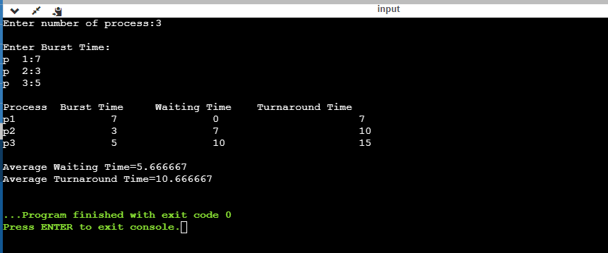

# FCFS (First Come First Serve)
## Aim: Write a C program to implement the various process scheduling mechanisms such as FCFS Scheduling.
### Algorithm:
1:Start the process
2:Accept the number of processes in the ready Queue
3:For each process in the ready Q,assign the process id and accept the CPU burst time
4:Set the waiting of the first process as '0' and its burst time as its turn around time
5:for each process in the Ready Q calculate
  a.Waiting time for process(n)=waiting time of process(n-1)+Burst time of process(n-1)
  b.Turn around time for process(n)=waiting time of process(n)+Burst time for process(n)
6:Calculate
  a.Average waiting time = Total waiting Time / Number of process
  b.Average Turnaround time = Total Turnaround Time / Number of process
7:Stop the process
#### OUTPUT:

